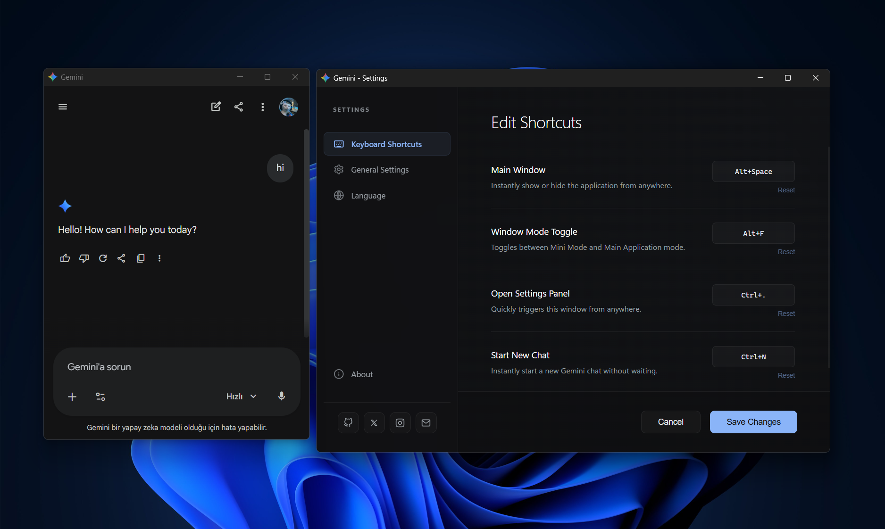
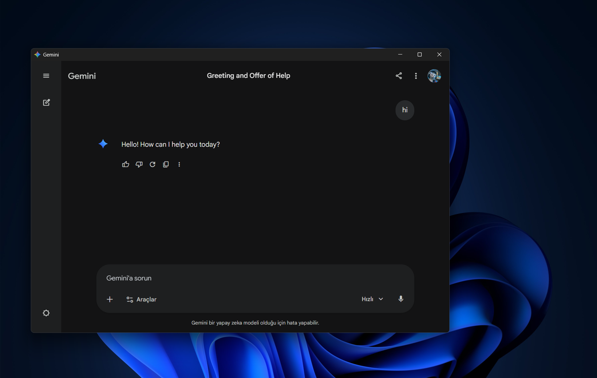

<div align="center">
  
  <h1>Gemini Desktop</h1>
  <p><strong>A Native, Cross-Platform Desktop Client for Google Gemini</strong></p>

  [](https://github.com/mustafahasturk/gemini-desktop/releases)
  [](https://github.com/mustafahasturk/gemini-desktop)
  [](https://tauri.app/)
  [](https://github.com/mustafahasturk/gemini-desktop/stargazers)
  [](#internationalization-i18n)
</div>

---

Gemini Desktop is a native client that brings the Google Gemini web interface directly to your operating system. Built with Rust and Tauri 2.0, it offers a highly optimized, cross-platform alternative to traditional browser wrappers.

## Screenshots

<div align="center">
  
  <br><br>
  
</div>


## Key Features

- **Cross-Platform Delivery:** Full support for Windows, macOS, and Linux with native OS integrations and respective distribution formats.
- **Resource Efficiency:** Built on the Tauri framework, ensuring a minimal memory footprint and optimized power consumption.
- **Global Shortcuts & Mini Mode:** Control the application state globally. A floating mini-window can be toggled instantly to preserve workflow focus.
- **Internationalization (i18n):** Native support for over 20 languages with dynamic resource management and automatic fallbacks.
- **System Tray Integration:** Run seamlessly in the background with a localized, context-aware tray menu.
- **Persistent Configuration:** Built-in store synchronization for shortcuts, display modes, and start-on-boot behaviors.

## Supported Languages

Gemini Desktop natively supports 21 languages with automatic resource loading and seamless on-the-fly switching without requiring app restarts:

| Language | Code | &nbsp; | Language | Code | &nbsp; | Language | Code |
| :--- | :---: | :--- | :--- | :---: | :--- | :--- | :---: |
| **Arabic** | `ar` | | **Hindi** | `hi` | | **Indonesian** | `id` |
| **Azerbaijani** | `az` | | **Italian** | `it` | | **Spanish** | `es` |
| **Chinese** | `zh` | | **Japanese** | `ja` | |**Swedish** | `sv` |
| **Dutch** | `nl` | | **Korean** | `ko` | |  **Thai** | `th` |
| **English** | `en` | | **Polish** | `pl` | | **Turkish** | `tr` |
| **French** | `fr` | | **Portuguese** | `pt` | | **Ukrainian** | `uk` |
| **German** | `de` | | **Russian** | `ru` | | **Vietnamese** | `vi` | 


## Installation

Download the latest pre-compiled binaries for your operating system (`.exe`, `.dmg`, `.deb`, `.rpm`) from the [Releases](https://github.com/mustafahasturk/gemini-desktop/releases) page.

## Development Setup

To build the project locally, ensure you have Node.js, Rust, and the Tauri prerequisites installed for your OS.

```bash
# Clone the repository
git clone https://github.com/mustafahasturk/gemini-desktop.git
cd gemini-desktop

# Install frontend dependencies
npm install

# Run in development mode
npm run tauri dev

# Build for production
npm run tauri build
```

## Architecture Overview

- **Backend:** [Rust](https://www.rust-lang.org/), [Tauri v2](https://tauri.app/)
- **Frontend:** [React](https://reactjs.org/), TypeScript, [Vite](https://vitejs.dev/)
- **State Management:** `tauri-plugin-store`

## Contributing

Contributions are welcome. Please open an issue to discuss proposed changes or architectural modifications before submitting a Pull Request.

## License

This project is licensed under the MIT License. See the `LICENSE` file for details.

---

<div align="center">
  <p>Made with ❤️ by <a href="https://github.com/mustafahasturk">Mustafa Hastürk</a></p>
</div>
